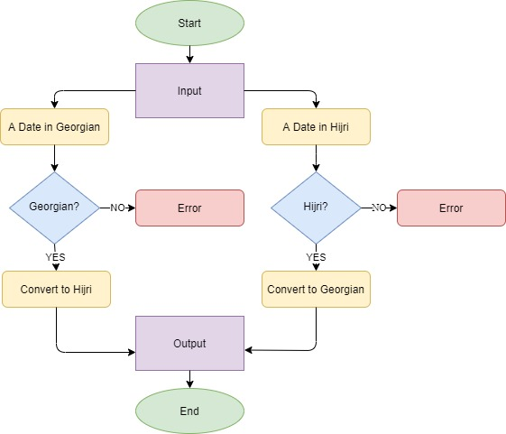

# Date_Converter

## Description
This is a project where I implemented a date converter in Python. It converts a Hijri date to a Gregorian date and vice versa. Also, this date converter program gives the name of the day of requested date. In this project the Graphic User Interface (GUI) was implemented through the PySimpleGUI API and the date conversion functions were implemented using the hijri-converter API. These APIs allowed me to simply implement the program's functionality with the fewest lines possible and with absolute clarity of design. Finally, made an executable out of this project using the pyinstaller API.

## Project status
Completed! :)

## Python Version
Python Version 3.8

## Flowchart

## Installation
[hijri-converter](https://pypi.org/project/hijri-converter/)

[PySimpleGUI](https://pypi.org/project/PySimpleGUI/)

[PyInstaller](https://pypi.org/project/PyInstaller/)

## Author
Abdullah Najjar

## License
[GNU License](https://www.gnu.org/licenses/gpl-3.0-standalone.html)
